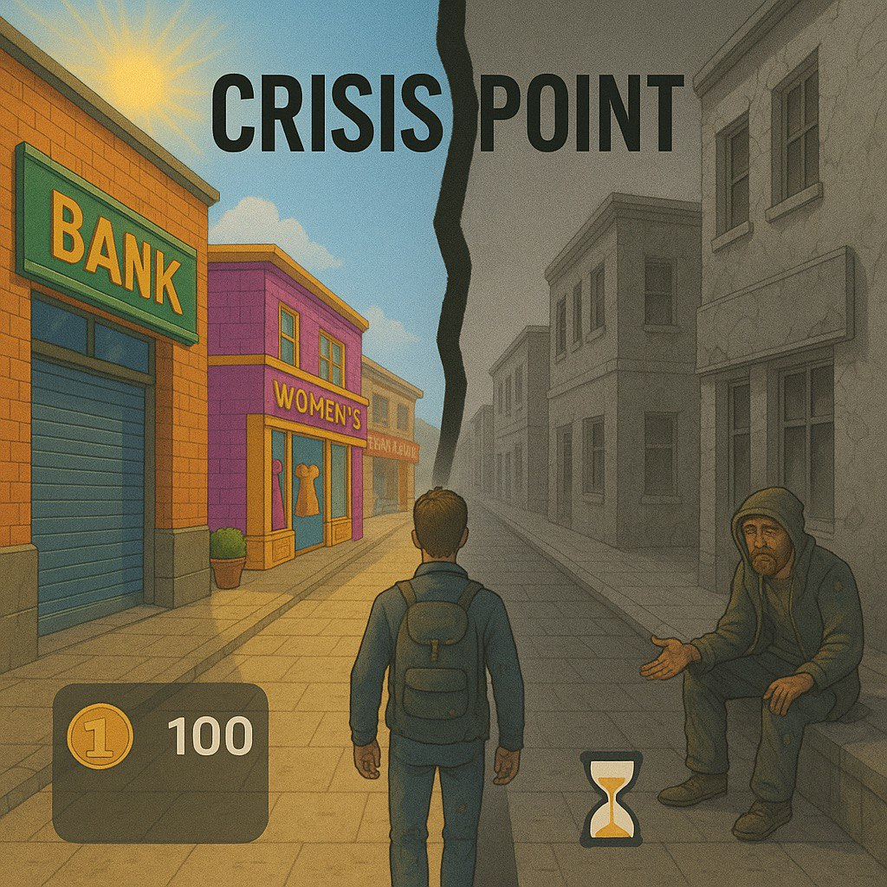

<h1>Crisis Point</h1>

<strong>"זה הרגע שלך לקחת סיכונים, לצאת מחוץ לקופסא ולהתמודד עם החלטות קשות בדרך לעושר"</strong>

<h2>מהות המשחק</h2>

הרגע ששעון הזמן אוזל משנה את פני המשחק — השחקן מתחיל את שלב ההישרדות וצריך לבצע משימות שונות בכדי לצבור כסף. השחקן צריך לבחור אסטרטגיה לשרוד את המשחק מבלי למות, להתמודד עם בחירות קשות ולנהוג באומץ.
משחק זה נועד לאמן את המטופל בהפעלת שיקול דעת וגמישות מחשבתית תחת תנאים שאינם אופטימליים, תוך תחושת הישגיות וריגוש. המשחק נגיש להורדה במחשב.

<em>(Gimini)</em>

<h2>רכיבים רשמיים</h2>

<h3>שחקנים</h3>
<ul>
  <li>המשחק מונגש עבור <strong>שחקן יחיד</strong>.</li>
  <li>מיועד למתבגרים בעלי קשיים תפקודיים־ניהוליים, בדגש על גמישות מחשבתית ואינהיביציה (עיכוב תגובה).</li>
  <li>מתאים לאוכלוסייה לאחר פגיעות ראש (ירידה בתפקודי האונה הפרונטלית) או מתבגרים עם ADHD בדגש על קשיים בתפקודים ניהוליים.</li>
  <li>המשחק משוחק במחשב כדי לאפשר <strong>תצפית של מרפאה בעיסוק</strong>.</li>
  <li>מסייע לתרגול: קבלת החלטות מהירה וטובה יותר, עיכוב תגובה בסיטואציות שונות, וגמישות מחשבתית.</li>
  <li>כלי עזר אפשרי לחקר חברתי־כלכלי; מתאים מגיל <strong>13+</strong> למודעים יותר להיבט הכספי תחת אילוצי השגרה.</li>
  <li>נדרשת תשוקה למשחקי מתח תחת תנאי לחץ.</li>
  <li>שחקנים ניצבים קיימים לשדרוג החוויה; יחסיהם עם השחקן חד־צדדיים — רק השחקן מתוגמל מהם כחלק מהמשימות.</li>
</ul>

<h3>יעדים</h3>
<ul>
  <li>לצאת מהמשבר הכלכלי באמצעות ביצוע משימות הישרדות תחת תנאים מצומצמים וצבירת מטבעות.</li>
  <li><strong>יעד־על:</strong> לצבור כמה שיותר לבנים זהובים מן המטבעות ולבנות טירה. מתבצע בשלבים עם צבירת לבנים בסיום כל סבב.</li>
  <li>מספר הלבנים הנדרש ניתן להגדרה בצד השרת ובהתאם לעניין השחקנים.</li>
  <li>מרגע הכניסה למשבר הכלכלי — המסך הופך לאפור (מסמל "לא נגיש") ומופיע שעון זמן שמסמל את הזמן שנותר לחיים אם לא יחל שיקום וצבור כסף.</li>
  <li>הבנייה מודגשת כיעד קבוע לאורך כל המשחק.</li>
</ul>

<h3>תהליכים</h3>
<ul>
  <li>במפגש הראשון קופץ <strong>טיזר קצר (7 שניות)</strong> שמדגים את הקיצוניות בין חלקי המשחק ומייצר אדרנלין. הדמות מופיעה במצב משבר, בוכה ומבקשת עזרה: "אני חייב אותך כדי לבצע משימות ולצאת מהעוני".</li>
  <li>כל פעולות המשחק מתבצעות בעזרת <strong>עכבר ומקלדת</strong>.</li>
  <li><strong>שלב ראשון — עולם שפע:</strong> חצים, מודעות ופרסומים מסמנים היכן ניתן "לבזבז" כסף.</li>
  <li><strong>שלב שני — שלב ההישרדות:</strong> מופיעים עצמים/אנשים שיסייעו לצבור כסף. בלחיצה על אובייקט מוצגת הודעת משימה מפורטת; השחקן רשאי לבחור לבצע או לבחור משימה אחרת.</li>
  <li>כאשר נצברים מספיק מטבעות — חזרה לעולם האופטימלי. בסוף סבב: <strong>1,000 מטבעות = לבנה מוזהבת 1</strong>.</li>
</ul>

<strong>משימות לדוגמה:</strong> להשיג מים, לכבס בגדים, להכין אוכל, למצוא את הדרך הביתה, מציאת מחסה בזמן גשם ועוד.

<table>
  <thead>
    <tr>
      <th>משימה</th>
      <th>דרישה קוגניטיבית</th>
      <th>זמן מוקצב (תחילת משחק)</th>
      <th>זמן מוקצב (שלב מתקדם)</th>
      <th>שווי (מטבעות זהב)</th>
    </tr>
  </thead>
  <tbody>
    <tr>
      <td>להשיג מים</td>
      <td>גמישות מחשבתית ופתרון בעיות (מקורות לא שגרתיים; הדרישה משתנה תוך כדי)</td>
      <td>120 שניות</td>
      <td>60 שניות</td>
      <td>200</td>
    </tr>
    <tr>
      <td>כיבוס בגדים</td>
      <td>עיכוב תגובה ותכנון (בחירה בין אופציה מהירה/יקרה לבין חסכונית/איטית)</td>
      <td>90 שניות</td>
      <td>45 שניות</td>
      <td>150</td>
    </tr>
    <tr>
      <td>הכנת אוכל</td>
      <td>תכנון, גמישות והערכת משאבים (הרכבה יצירתית משאריות/מרכיבים מוגבלים)</td>
      <td>180 שניות</td>
      <td>90 שניות</td>
      <td>250</td>
    </tr>
    <tr>
      <td>למצוא את הדרך הביתה</td>
      <td>תכנון וזיכרון עבודה (מפה חלקית/משתנה, הדלקה/כיבוי אזורים)</td>
      <td>150 שניות</td>
      <td>75 שניות</td>
      <td>200</td>
    </tr>
    <tr>
      <td>מציאת מחסה</td>
      <td>מהירות תגובה ושיקול דעת תחת לחץ (אפשרויות מבלבלות מול נכונות)</td>
      <td>60 שניות</td>
      <td>30 שניות</td>
      <td>100</td>
    </tr>
  </tbody>
</table>

<h3>חוקים</h3>
<ul>
  <li>בפתיחה: <strong>2,000 מטבעות</strong> לשחקן.</li>
  <li>אין רכישה מעבר לסכום הקיים.</li>
  <li>עם אפס מטבעות — מעבר ל<strong>משבר כלכלי</strong>; אין גישה לרכישות במרכז הקניות.</li>
  <li>צבירת <strong>1,500 מטבעות</strong> מוציאה מהמשבר ומנצחת את הסבב (מוצג יעד ליד סכום המטבעות).</li>
  <li>בכניסה ראשונה לכל משימה — הדמיה קצרה של הנדרש (פעם ראשונה בלבד).</li>
  <li>לכל משימה זמן מוגדר מראש; אי־עמידה גוררת <strong>קנס של 50%</strong> מערך המשימה.</li>
  <li>חוסר פעילות במשך <strong>35 שעות</strong> גורר איבוד <strong>3 לבנים</strong> מהטירה; התראה נשלחת <strong>10 שעות</strong> לפני כן.</li>
</ul>

<h3>משאבים</h3>
<ul>
  <li><strong>מטבעות זהב:</strong> המשאב המרכזי במשחק. סך המטבעות מוצג בצד שמאל למטה על המסך כאלמנט שמדרבן את השחקן לצבור עוד ועוד כסף.</li>
  <li>בשלב המשבר הכלכלי מוצג גם מספר המטבעות שנותר ליעד (1,500).</li>
  <li>השחקן מאבד כסף כאשר הוא רוכש מוצרים בשלב השפע.</li>
  <li>השחקן מרוויח כסף בעת השלמת משימות קוגניטיביות בשלב המשבר. המשימות מדורגות לפי רמות קושי (קל, בינוני, קשה) ותגמול בהתאם.</li>
  <li>עם התקדמות המשחק זמן המשימה מתקצר, נוצר לחץ מתגבר ונשמעת התרעת קול דרמטית כשהזמן כמעט נגמר.</li>
  <li><strong>לבנים מוזהבות:</strong> נצברות מסבבי משחק ומאפשרות לבנות את הטירה — יעד המשחק הסופי ובעל הערך הגבוה ביותר במשחק. השחקן יכול לגשת לטירה שלו בכל שלב כדי לבדוק את מצב הבנייה.</li>
</ul>

<h3>עימותים</h3>
<h4>בין השחקן לעצמו</h4>
<ul>
  <li>בחירת משימות הכוללות רמת סיכון משתנה.</li>
  <li>תרגול גמישות מחשבתית במצב הישרדותי ולא אופטימלי.</li>
  <li>חישוב עלות מול תועלת בכל החלטה (זמן, כסף, סיכון).</li>
  <li>אימון עיכוב תגובה (Inhibition) תחת לחץ זמן.</li>
  <li>שמירה על קשב וריכוז גם במשימות הקטנות וגם לאורך המשחק כולו.</li>
</ul>

<h4>בין השחקן למערכת</h4>
<ul>
  <li>איבוד זמן במשימה בעקבות כישלונות חוזרים (2 משימות ברצף).</li>
  <li>אי־נגישות למרכז הקניות בזמן משבר כלכלי.</li>
  <li>חוסר פעילות ממושכת גורר איבוד לבנים.</li>
  <li>כישלון במשימה גורם לאיבוד 50% מערכה במטבעות.</li>
</ul>

<h3>גבולות המשחק</h3>
<ul>
  <li><strong>העולם:</strong> ממשק דו־ממדי של מרכז קניות ("ביג"). הניווט נעשה באמצעות עכבר (הזזה, לחיצה).</li>
  <li><strong>שינוי מצב:</strong> מעבר ממצב אופטימלי (גישה לקניות) למצב משבר (הישרדות וצבירת כסף). רוב המסך נעשה "לא נגיש" כדי להתמקד במשימות.</li>
  <li><strong>ניידות:</strong> עכבר ומקלדת בלבד (לחיצות על אובייקטים, הזנת נתונים בחלונות משימה).</li>
  <li><strong>התמצאות:</strong> מצב אופטימלי — עולם צבעוני; מצב משבר — מסך אפור; יעד 1500 מטבעות גלוי תמיד.</li>
  <li><strong>עניין:</strong> משימות קוגניטיביות מדורגות, זמן מתקצר, לחץ עולה.</li>
  <li><strong>הכוונה:</strong> טיזר ראשוני של 7 שניות, הדמיה ראשונית לכל משימה, והתראות על איבוד לבנים.</li>
</ul>

<h3>תוצאות</h3>
<ul>
  <li>ניצחון מושג כאשר השחקן מצליח לצאת מהמשבר הכלכלי ולצבור לפחות 1500 מטבעות.</li>
  <li>הצלחה תלויה גם באלמנטים משתנים (מזל, הנחיה של מטפל), אך מהות המשחק היא בחיזוק יכולות קוגניטיביות והתמודדות במצבי לחץ.</li>
  <li>השחקן הוא יחיד — הצלחתו אינה משפיעה על אחרים.</li>
  <li>אי פעילות של 35 שעות גורמת לאיבוד 3 לבנים.</li>
  <li>סיום המשחק = סיום בניית הטירה (בהתאם להגדרת השרת).</li>
</ul>

<h3>סקירת משחקים קיימים</h3>

<h4>Adventure Escape: Space Crisis</h4>

משחק הרפתקאות ופתרון חידות המתרחש בתחנת חלל עתידנית. השחקן נכנס לנעליה של מפקדת בשם מורגן ומנסה לגלות את סיבת היעלמות הצוות. המשחק משלב פתרון בעיות תחת לחץ וביצוע אתגרי הישרדות ייחודיים. <em>(App Store)</em>

<a href="https://apps.apple.com/il/app/adventure-escape-space-crisis/id1089068515?l=he">קישור</a>

<h4>Block Blast!</h4>

משחק פאזלים לוגי קלאסי עם אתגרי חשיבה, מתאים לכל הגילאים. המשחק מעודד תכנון, חשיבה לוגית ועיכוב תגובה תחת מגבלת זמן. <em>(App Store)</em>

<a href="https://apps.apple.com/il/app/block-blast/id1617391485?l=he">קישור</a>

<h4>The Globe Dilemma</h4>

משחק סימולציה כלכלית עולמית בו השחקן מנהל מדינה ומנסה לשפר את כלכלתה, לצמוח ולכבוש משאבים. מדמה התמודדות עם אתגרים מערכתיים גלובליים. <em>(PC)</em>

<a href="https://www.myabandonware.com/game/the-global-dilemma-guns-or-butter-wk">קישור</a>

<h3>ייחודיות המשחק שלנו</h3>
<ul>
  <li><strong>חלוקה לשלבים:</strong> מעבר בין עולם צבעוני לשחור־לבן המדמה את השבר הכלכלי ויוצר תחושת אדרנלין והישרדות.</li>
  <li><strong>אחריות אישית:</strong> החלטות השחקן משפיעות עליו בלבד, בניגוד למשחקים גלובליים.</li>
  <li><strong>תצפית קלינית:</strong> מאפשרת למרפאה בעיסוק לעקוב אחר תהליכי קבלת החלטות ותגובות.</li>
  <li><strong>שילוב למידה והנאה:</strong> אימון קוגניטיבי לצד חוויה רגשית של הישרדות, בנייה והצלחה.</li>
</ul>

